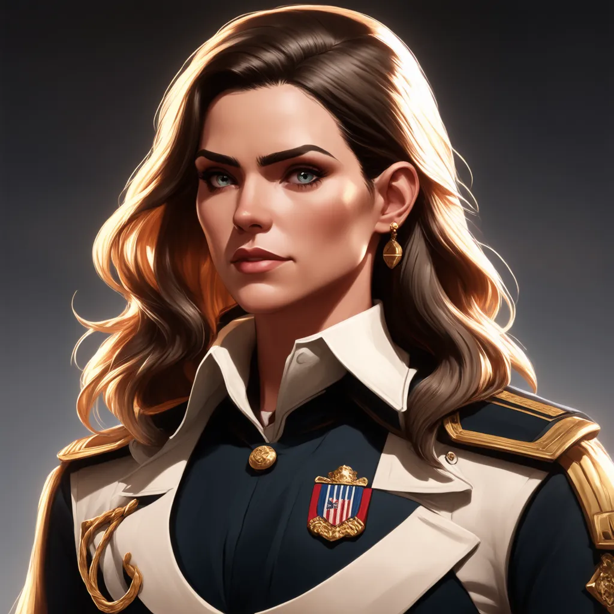
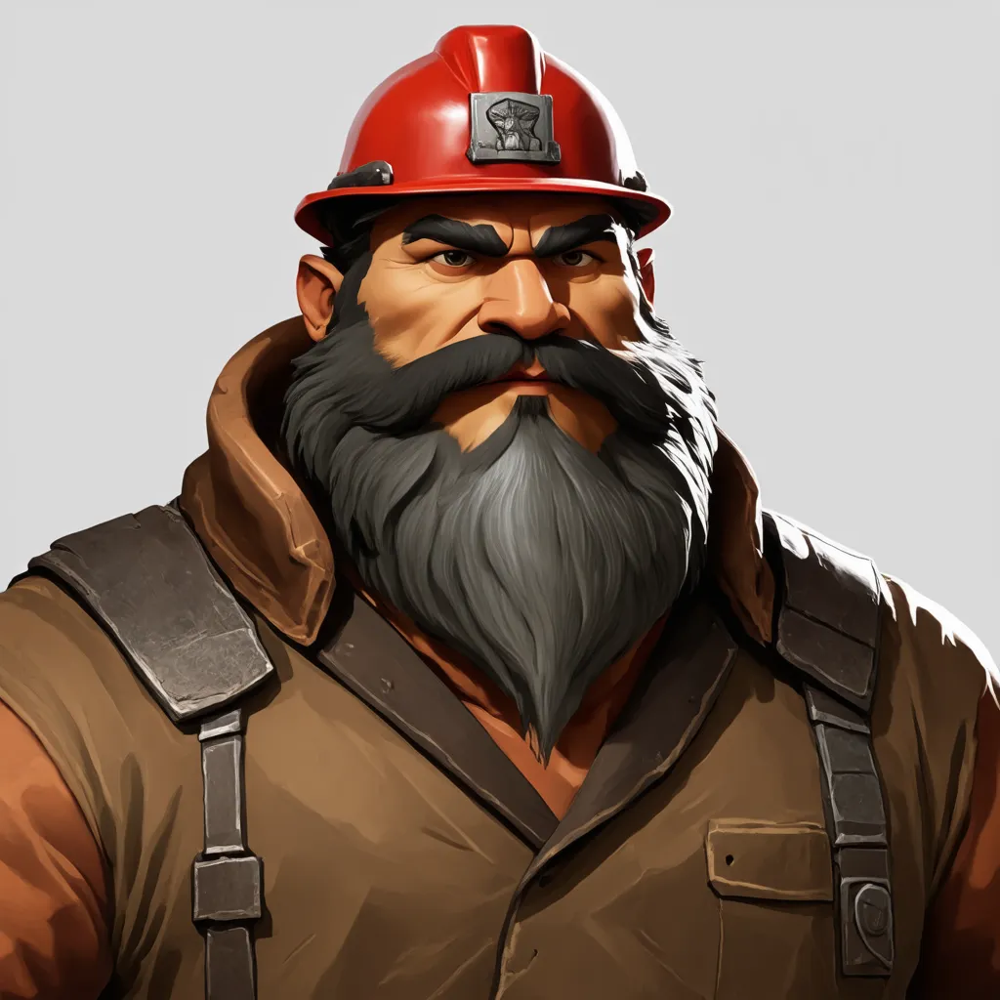
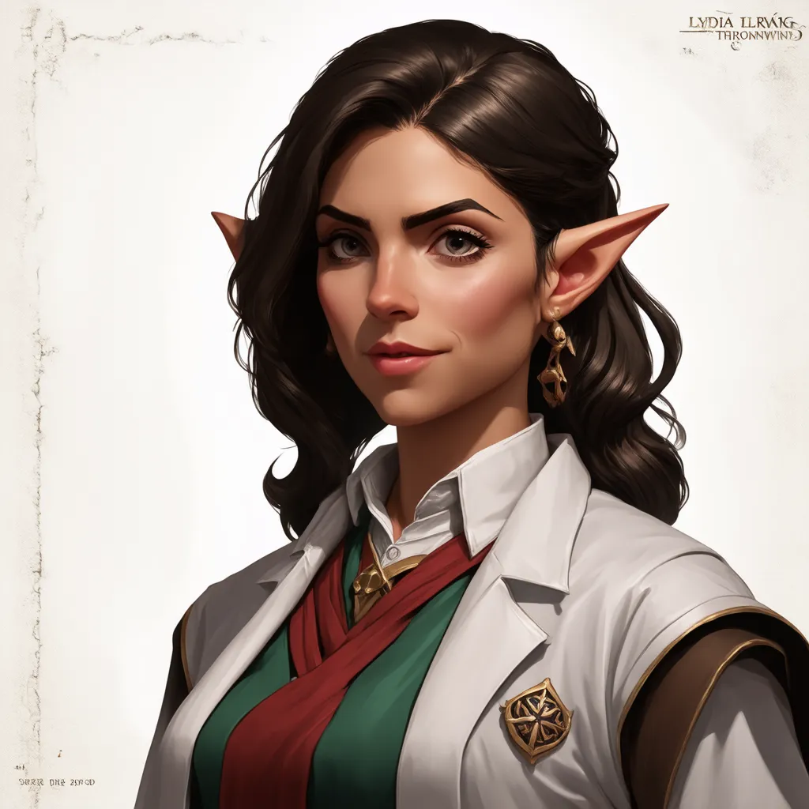
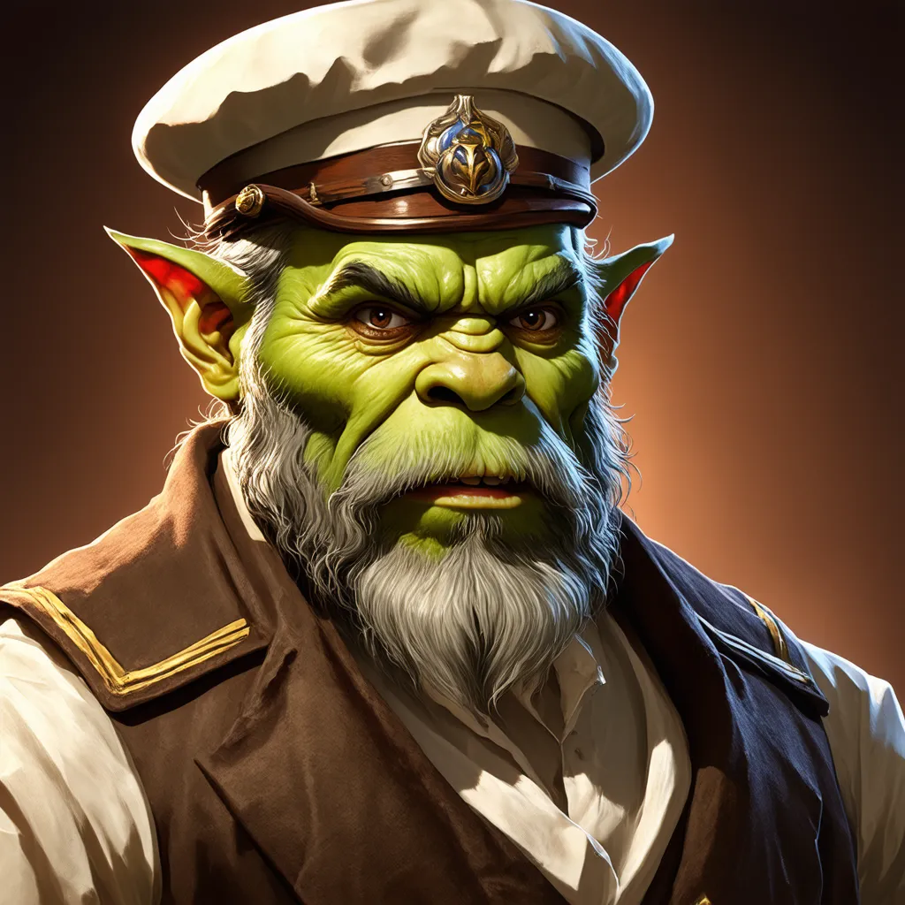
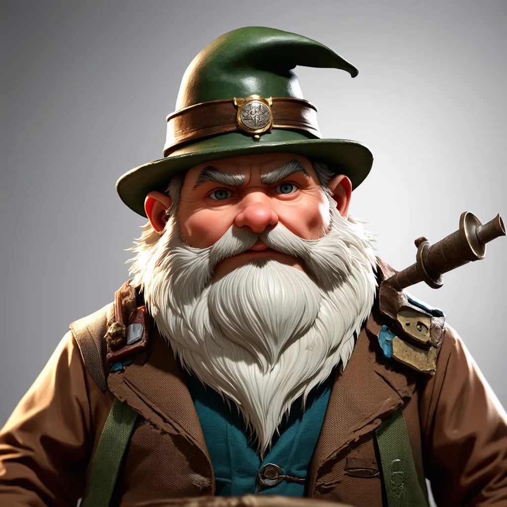

# NPCs

## Confederacy

### Magistrate Vex Shadowmere (Tiefling, female)

| Image | Background | Personality | Goal |
|:-----:|------------|-------------|------|
|  | High-ranking official in the Confederacy | Charismatic, manipulative, ambitious | Expand the Confederacy's influence and power |

## Prison Ship

### Captain Thorne Blackwater (Human, male)

| Image | Background | Personality | Goal |
|:-----:|------------|-------------|------|
|  | Grizzled captain of the prison ship | Cynical, world-weary, but fair | Deliver prisoners safely and return home |

## Port Walen

### Governor Elara Brightstone (Human, female)

| Image | Background | Personality | Goal |
|:-----:|------------|-------------|------|
|  | Former naval captain, appointed to oversee Port Walen's development | Stern, ambitious, values order and progress| Expand Confederate influence on Junderoth at any cost |

Elara's keen eye for detail and strong sense of duty were noted by her
superiors in Grisellden years ago. When it came to decide who should run
the Confederacy's outpost on Junderoth, she was the obvious choice. She
is determined to make Port Walen a success, no matter the cost.

### Foreman Grok Ironfist (Dwarf, male)

| Image | Background | Personality | Goal |
|:-----:|------------|-------------|------|
|  | Experienced miner and construction manager | Gruff, practical, secretly sympathetic to prisoners | Ensure Port Walen's infrastructure expands efficiently |

### Dr. Lydia Thornwind (Half-Elf, female)

| Image | Background | Personality | Goal |
|:-----:|------------|-------------|------|
|  | Arcanobiologist studying Junderoth's unique flora and fauna | Curious, absent-minded, ethically conflicted | Uncover the secrets of Junderoth's sudden appearance and its magical ecosystem |

### Zephyr (Air Genasi, non-binary)

| Image | Background | Personality | Goal |
|:-----:|------------|-------------|------|
|  | Rogue archaeologist and treasure hunter | Charismatic, cunning, always looking for the next big score | Uncover valuable artifacts from Junderoth's ruins |

### "Old Salt" Maris (Orc, Male)

| Image | Background | Personality | Goal |
|:-----:|------------|-------------|------|
|  | Retired sailor, owner of The Rusty Anchor Tavern | Gruff, gregarious, full of tall tales | Keep the drinks flowing and the information circulating |

Old Salt has been around, he's got the tattoos of obsidian dragons to prove 
he's done the Horn of Käs. With the little money he had saved from his travels
coupled with the Confederacy's generous homesteading and business grants for 
those willing to brave Junderoth, he decided to have one last adventure: 
running a tavern.

### Tinker Sprocketspring (Gnome, male)

| Image | Background | Personality | Goal |
|:-----:|------------|-------------|------|
|  | Gnome inventor and entrepreneur, proprietor of _Expedition Outfitters_ | Eccentric, inventive, always tinkering | Discover new sources of energy, both magical and mundane, in Junderoth |

Tinker Sprocketspring is a gnome of many talents. He's a skilled inventor,
entrepeneur and surprisingly good cook. His decision to ups sticks from
Busynook and set up shop in Port Walen was a no-brainer. Junderoth is an 
unknown quantity that might hold the key to his next big invention.

## Forest

### Chief Croak-in-Thunder (Grung, male)

| Image | Background | Personality | Goal |
|:-----:|------------|-------------|------|
|  | Leader of the local Grung tribe | Proud, territorial, but willing to negotiate if treated with respect | Protect his people and their ancestral lands from invaders |

### Whisper-of-Leaves (Grung, female)

| Image | Background | Personality | Goal |
|:-----:|------------|-------------|------|
|  | Shaman of the Grung tribe | Wise, mystical, fiercely protective of her people | Maintain balance with nature and the spirits of the forest |
